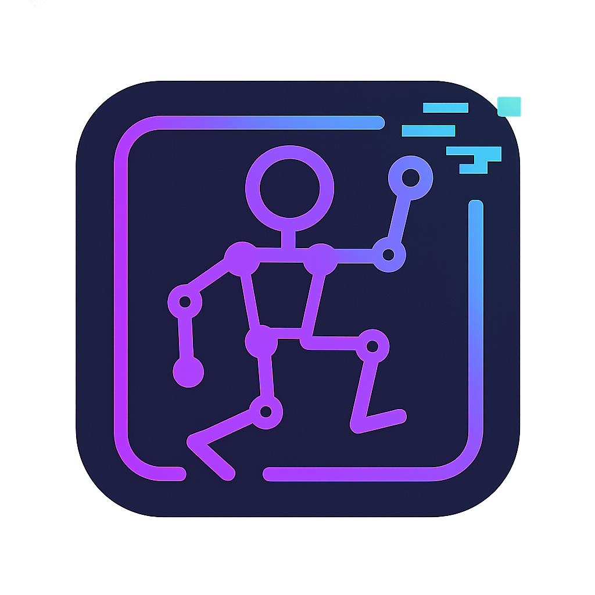

#  FrameLab

Check it out:
<p>
  <a href="https://frame-lab-chi.vercel.app/" target="_blank" rel="noopener noreferrer">
    
  </a>
  &nbsp;
  <a href="https://www.buymeacoffee.com/vucinatim" target="_blank" rel="noopener noreferrer">
    
  </a>
</p>

**FrameLab** is a web-based multi-frame image generation tool that enables you to create consistent character animations using AI. Design custom pose sequences with an interactive OpenPose editor, then generate a complete series of character images that maintain visual consistency across all frames.

 

## ✨ Features

* **Interactive OpenPose Editor:** Create and fine-tune character poses using an intuitive skeleton-based editor with 25 keypoints for full body control.
* **AI Character Generation:** Generate a character from a text prompt or upload your own reference image to use as the base character.
* **Multi-Frame Animation Sequences:** Design complete animation sequences by creating different poses across multiple frames.
* **Character Consistency:** Uses IP-Adapter technology to maintain character identity and visual consistency across all generated frames.
* **Advanced Prompt System:** Fine-grained control with character descriptions, motion prompts, and frame-specific customizations.
* **Real-time Preview:** See your pose adjustments instantly with live skeleton visualization and animation playback.

## 🤔 How It Works (The Magic)

FrameLab combines OpenPose skeletal data with IP-Adapter character consistency to generate coherent multi-frame animations.

1.  **Character Setup:** Upload or generate a character image that will serve as the visual reference for all frames.
2.  **Pose Design:** Use the OpenPose editor to create skeletal poses for each frame of your animation. The editor provides 25 keypoints covering the full body including hands and feet.
3.  **Prompt Engineering:** Define your character's appearance, motion style, and optional frame-specific details using the multi-layered prompt system.
4.  **AI Generation:** The system combines:
    * **OpenPose ControlNet** to ensure each generated frame matches your designed skeleton pose exactly
    * **IP-Adapter** to maintain character identity and visual consistency across all frames
    * **ComfyUI Workflow** running on Replicate to orchestrate the generation process
5.  **Frame Sequence:** The result is a series of character images that can be combined into animations, sprite sheets, or used individually.

## 🚀 Usage

Creating your first character animation sequence:

1.  **Setup Your Character:** 
    * Use the "Generate Character" panel to create a character from a text prompt, or
    * Upload your own character image using the "Character Image" uploader
2.  **Design Your Animation:**
    * Use the frame timeline to navigate between animation frames
    * Click and drag joints in the pose editor to create unique poses for each frame
    * Use copy/paste and duplicate functions to speed up pose creation
3.  **Configure Prompts:**
    * **Character Prompt:** Describe your character's visual appearance (e.g., "fantasy warrior, red armor, black cape")
    * **Motion Prompt:** Describe the overall motion (e.g., "running at full speed, facing right")
    * **Frame Prompts:** Optional specific details for individual frames (e.g., "mid-stride, right foot forward")
4.  **Generate:** Click "Generate Current Frame" for single frames or "Generate Sequence" to create all frames at once
5.  **Preview & Export:** Use the animation playback controls to preview your sequence

## 🏗️ Architecture

FrameLab is built with modern web technologies optimized for interactive pose editing and AI generation workflows.

**Frontend & Core:**
* **Framework:** [Next.js](https://nextjs.org/) with App Router for full-stack TypeScript development
* **State Management:** [Zustand](https://github.com/pmndrs/zustand) for fast, reactive client-side state management
* **UI Components:** [shadcn/ui](https://ui.shadcn.com/) for accessible, customizable UI components
* **Pose Editor:** Custom OpenPose editor built with [Konva.js](https://konvajs.org/) and React for interactive skeleton manipulation

**AI Pipeline:**
* **Generation Platform:** [Replicate](https://replicate.com/) for scalable AI model hosting
* **Workflow Engine:** Custom [ComfyUI](https://github.com/comfyanonymous/ComfyUI) workflow for complex multi-model pipelines
* **Pose Control:** OpenPose ControlNet for precise pose-to-image generation
* **Character Consistency:** IP-Adapter for maintaining character identity across frames
* **Base Models:** Stable Diffusion 1.5 with DreamShaper checkpoint for high-quality output

**OpenPose Integration:**
* **Keypoint System:** 25-point body model including face, hands, and feet keypoints
* **Pose Generation:** Server-side pose image generation from skeleton data
* **Real-time Preview:** Client-side skeleton rendering and animation playback

**Data Flow:**
1. User creates poses using OpenPose editor → skeleton data stored in Zustand
2. Skeleton data converted to pose images using OpenPose rendering
3. Character image + pose image + prompts sent to ComfyUI workflow
4. IP-Adapter ensures character consistency while ControlNet enforces pose accuracy
5. Generated frames returned and displayed in the interface

## 🔧 Getting Started

To run this project locally:

1.  **Clone the repository:**
    ```bash
    git clone https://github.com/vucinatim/FrameLab.git
    cd FrameLab
    ```

2.  **Install dependencies:**
    This project uses `pnpm` as the package manager.
    ```bash
    pnpm install
    ```

3.  **Set up Environment Variables:**
    Create a `.env.local` file and add your Replicate API key:
    ```
    REPLICATE_API_TOKEN=your_replicate_api_token_here
    ```

4.  **Run the development server:**
    ```bash
    pnpm dev
    ```

5.  Open [http://localhost:3000](http://localhost:3000) in your browser.

## 🎯 Technical Details

**OpenPose Implementation:**
* Uses the BODY_25 model with 25 keypoints for comprehensive pose control
* Generates pose images server-side using canvas rendering
* Supports pose interpolation and animation preview

**IP-Adapter Integration:**
* Maintains character consistency through image prompt adaptation
* Balances character identity with pose control through weighted blending
* Supports fine-grained prompt control for character, motion, and frame-specific details

**ComfyUI Workflow:**
* Custom workflow combining ControlNet, IP-Adapter, and base Stable Diffusion
* Optimized for character generation with transparent background removal
* Configurable prompt injection and model parameters

## 🗺️ Roadmap

* [ ] Animation export (GIF, MP4, sprite sheets)
* [ ] More pose presets and motion templates  
* [ ] Batch generation optimizations
* [ ] Advanced ControlNet models (hands, face detail)
* [ ] Community sharing of poses and characters
* [ ] Integration with other pose estimation models

Contributions are welcome!

---

Built by [vucinatim](https://github.com/vucinatim).